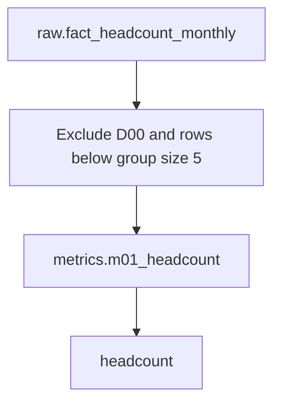
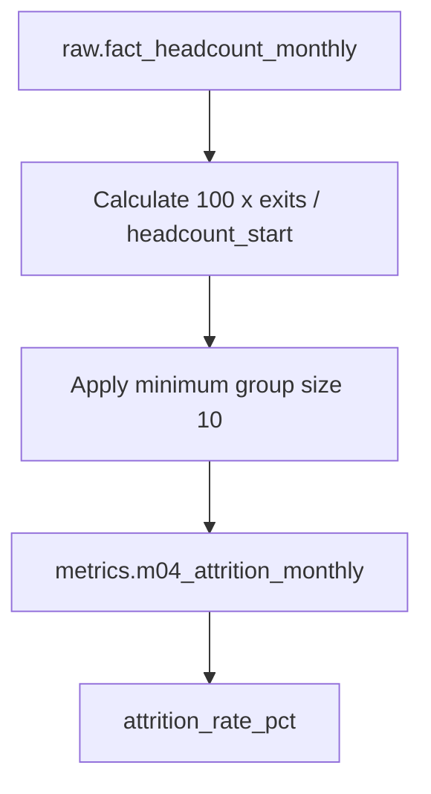
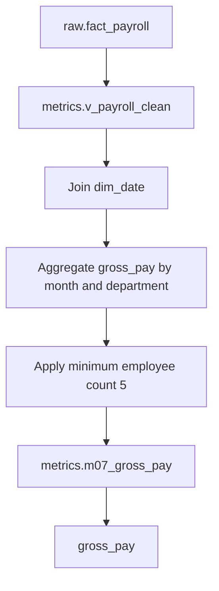
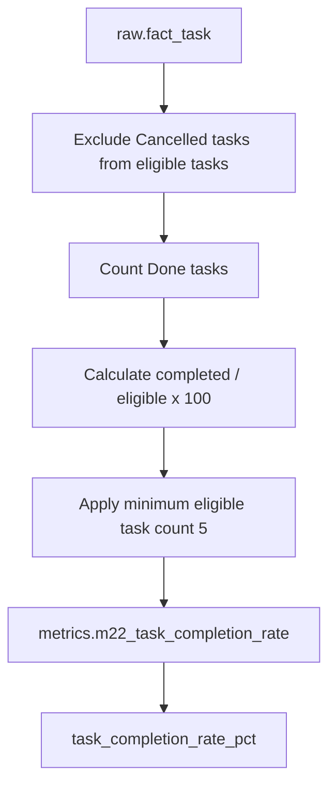
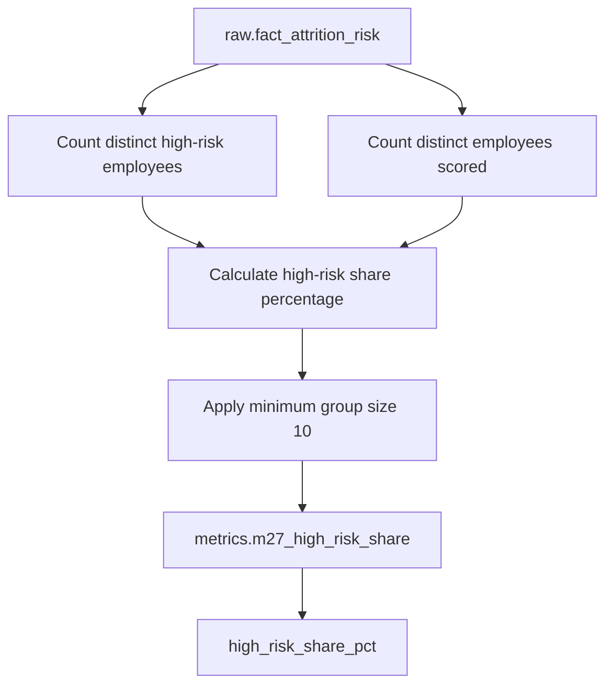

# PulseIQ KPI Source-to-Metric Lineage

## M01 - Headcount

```mermaid
flowchart TD
    A["raw.fact_headcount_monthly"]
    B["Exclude D00 and rows below group size 5"]
    C["metrics.m01_headcount"]
    D["headcount"]
    A --> B --> C --> D
```

## M04 - Monthly Attrition Rate

```mermaid
flowchart TD
    A["raw.fact_headcount_monthly"]
    B["Calculate 100 x exits / headcount_start"]
    C["Apply minimum group size 10"]
    D["metrics.m04_attrition_monthly"]
    E["attrition_rate_pct"]
    A --> B --> C --> D --> E
```

## M07 - Gross Pay

```mermaid
flowchart TD
    A["raw.fact_payroll"]
    B["metrics.v_payroll_clean"]
    C["Join dim_date"]
    D["Aggregate gross_pay by month and department"]
    E["Apply minimum employee count 5"]
    F["metrics.m07_gross_pay"]
    G["gross_pay"]
    A --> B --> C --> D --> E --> F --> G
```

## M22 - Task Completion Rate

```mermaid
flowchart TD
    A["raw.fact_task"]
    B["Exclude Cancelled tasks from eligible tasks"]
    C["Count Done tasks"]
    D["Calculate completed / eligible x 100"]
    E["Apply minimum eligible task count 5"]
    F["metrics.m22_task_completion_rate"]
    G["task_completion_rate_pct"]
    A --> B --> C --> D --> E --> F --> G
```

## M27 - High-Risk Share

```mermaid
flowchart TD
    A["raw.fact_attrition_risk"]
    B["Count distinct high-risk employees"]
    C["Count distinct employees scored"]
    D["Calculate high-risk share percentage"]
    E["Apply minimum group size 10"]
    F["metrics.m27_high_risk_share"]
    G["high_risk_share_pct"]
    A --> B --> D
    A --> C --> D
    D --> E --> F --> G
```
